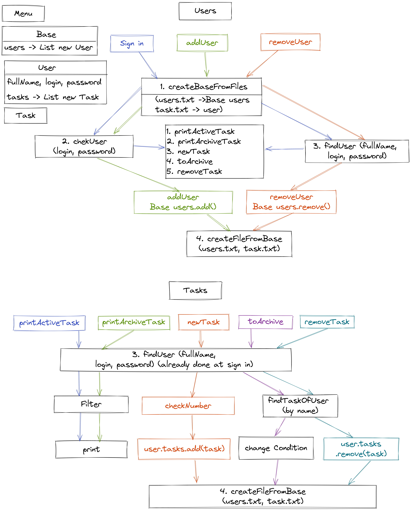

## Задание 
### Использовать (DataInputStream + (InputStream-FileInputStream) и DataInputStream + (OutputStream-FileOutputStream) )

### Написать приложение для управления персональным списком задач (ToDoList)

#### Реализовать функционал:
1. Регистрация нового пользователя (класс User)
2. Авторизация пользователя (ввод логина и пароля)

#### После авторизации появляется функционал:
1. Отображение списка всех не выполненных задач (отсортированные по важности и дате)
2. Отображение списка всех выполненных задач (отсортированные по дате в обратном порядке)
3. Добавление новой задачи (класс Task)
4. Отметка про выполнение задания
5. Удаление задачи
6. Выход

#### При выходе из программы данные должны сохраняться в файл.
#### При запуске - считываться из файла.

#### Каждая задача должна включать следующие данные:
1. Название
2. Важность (от 1 до 5)
3. Срок выполнения (опционально)
4. Категория (опционально)
5. Архивирование выполненных задач (после архивирования исчезают из списка)

